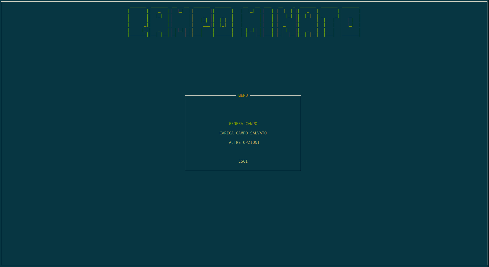
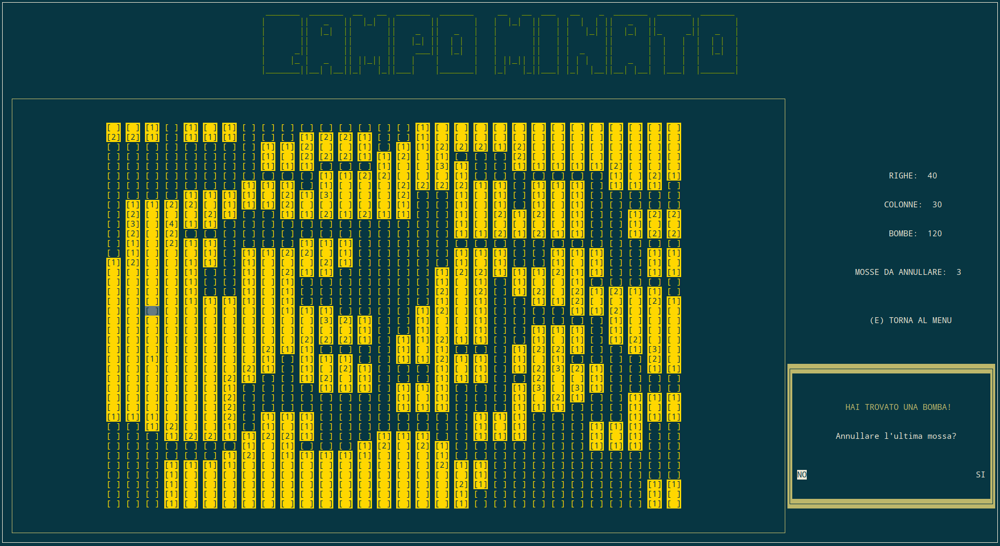

# MineField
Project for Programming course, a.a. 2016/2017.

# Introduction
Command-line version of the classic MineField game.
Play alone and try to win or start a bot and let him win for you!

---
**PAY ATTENTION** &nbsp;&nbsp; It only supports Italian Language!

---

# Install the game

First download the game using this command:
    
    git clone https://github.com/westfox-5/MineField

Then compile all the sources:

    make install

This creates a `dist` folder, in which there are compiled files and the executable named `campo` .
 
Do these last two things:

* Add permissions to the executable file:

       sudo chmod u+x dist/campo

* Set your terminal fullscreen or maximize it.

## Now just play and enjoy!

        ./dist/campo

#  How to play

In the main menu you can select one of 3 options:

* GENERA CAMPO: crates a new field with specified dimensions
* CARICA CAMPO SALVATO: loads the last field played
* ALTRE OPZIONI: there's the choice for Hard, Medium, Easy difficulty

After that you will asked the maximum number of moves you can go back when a bomb is hit. After reached this number, if you hit a bomb you lose.

Then choose if you want the AI (a simple random bot xD) play or not.

### List of commands
 
* Directional arrows for move
* `1` to uncover the selected cell
* `2` to place a flag in the selected cell
* `e` to exit game
---

# Screens

**Main menu of the game**

**Game screen**

---

Project made with [gzanetti](https://github.com/gzanetti)